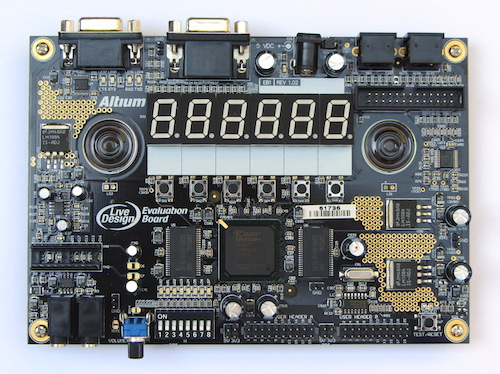

Xilinx LiveDesing utils
-----------------------

This repository contains various files useful when working with
Xilinx version of the Altium LiveDesign board.

The board is quite old, to be honest (I've bought mine a few years ago), 
but with Xilinx Spartan 3 FPGA (XC3S1000 in my case, there was also a smaller
XC3S400 edition) it is still quite powerful. It could have slightly better
peripherals, but well...

What's in this repo:

 * [docs](docs) - original docs from Altium
 * [jtag_pcb](jtag_pcb) - a project of small PCB converting Altium's silly 26-pin programming connector into standard Xilinx JTAG
 * [livedesign.ucf](livedesign.ucf) - UCF file for use with Xilinx WebPACK
 * [test](test) - simple test project

