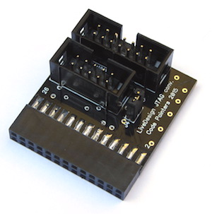

This directory contains the schematic and PCB files for a simple 
JTAG pinout converter from Altium's to standard Xilinx 14-pin 
connector.

Altium uses 26-pin IDC connector which maps directly to
a DB25 LPT plug. The pinout is as follows:

| Name | Pin | Pin | Name  |
|------|-----|-----|-------|
| -    | 1   | 2   | -     |
| hTDI | 3   | 4   | hVREF |
| hTCK | 5   | 6   | -     |
| hTMS | 7   | 8   | sTMS  |
| OE   | 9   | 10  | GND   |
| -    | 11  | 12  | GND   |
| sTDI | 13  | 14  | GND   |
| -    | 15  | 16  | GND   |
| sTCK | 17  | 18  | GND   |
| sTDO | 19  | 20  | GND   |
| -    | 21  | 22  | GND   |
| -    | 23  | 24  | GND   |
| hTDO | 25  | 26  | -     |

Note:
 
 * don't get confused by the pin numbering on the Altium schematics. They
   use the numbers corresponding to pins of the DB25 connector at 
   the other end of the flat cable. For normal IDC26 numbering use 
   the table above.

 * there are 2 sets of JTAG signals exposed - "hard" one is connected 
   to the FPGA's JTAG pins, this is the one to use to program the FPGA.
   Second one, referred to as "soft", is supposed to be used to debug 
   any soft-core CPU implemented in FPGA. It is connected to regular I/O
   pins: TMS - L21N, TCK - L24P, TDI - L21P, TDO - L17P.
 
 * pin 4 is pulled to `VCC` via 4k7 resistor, not sure what for, but 
   it seemed to be a good candidate for `VREF`. Unfortunately, it doesn't
   work as is (at least with the cable I use), see below.

 * pins 15, 21 and 23 are shorted together, but it's irrelevant for us

 * there is a 3-state buffer on board, OE connected to pin 9, it has 
   to be pulled low for anything to work 

The board is equipped with connectors for both JTAG chains:
 
 * IDC14 connector for "hard JTAG", compatible with Xilinx cables
 * IDC10 connector for "soft JTAG", using ARM JTAG pinout

The Xilinx cable requires 3.3V on JTAG `VREF` pin, and initially wanted 
to connect pin 4 there, unfortunately it doesn't work (scanning the chain,
reading the ID etc. works fine, but actual programming fails).

There are two workarounds - one is to remove the jumper `J4` jumper and connect
its pin 2 to any `VCC` point on LiveDesign board. Another workaround is to
short `R20S` on LiveDesign PCB.
